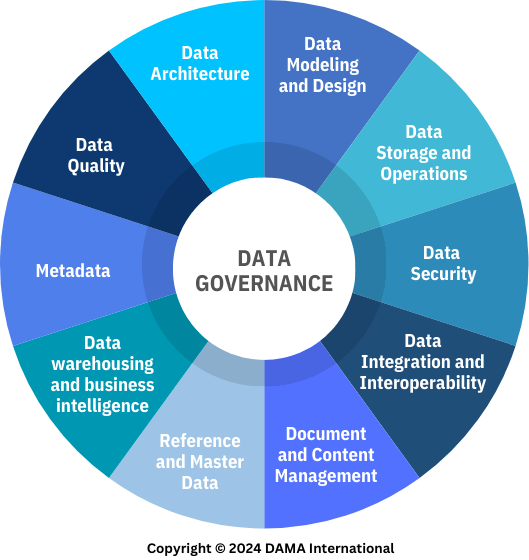
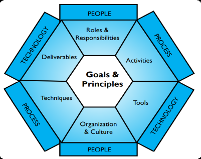

# DataManagement overview <!-- omit in toc -->

## Contents <!-- omit in toc -->

- [1. Source](#1-source)
- [2. What is Data Management](#2-what-is-data-management)
- [3. Data Management Essential Concepts](#3-data-management-essential-concepts)
  - [3.1. Data vs. Information](#31-data-vs-information)
- [4. Data Management Principles](#4-data-management-principles)
  - [4.1. Summary Table](#41-summary-table)
- [5. The DAMA-DMBOK Framework](#5-the-dama-dmbok-framework)

# 1. Source

- _DAMA International. Data Management Body of Knowledge (DMBoK) (2nd ed. revised). Technics Publications._

# 2. What is Data Management

- Data Management is the development, execution, and supervision of plans, policies, programs, and practices that deliver, control, protect, and enhance the value of data and information assets throughout their lifecycles.

# 3. Data Management Essential Concepts

- Data.
  - **Data** consists of **raw facts and figures** that can be processed to generate meaningful information.
- Information.
  - **Information** is **processed data** that has context, meaning, and value, enabling better decision-making.
- Data as an Organizational Asset.
  - Organizations recognize **data as a valuable business asset** that can drive growth and competitive advantage.
- **Proper data management maximizes**
  - Business value.
  - Decision quality.
  - Operational efficiency.

## 3.1. Data vs. Information

| Data       | Information                    |
| ---------- | ------------------------------ |
| Raw facts  | Processed and meaningful facts |
| No context | Includes context and analysis  |
| Stored     | Used for decision-making       |

# 4. Data Management Principles

1. Data as an Asset.
   - Organizations should treat **data as a valuable business asset**.
2. Economic Value of Data.
   - Proper data management creates **financial and operational benefits**.
3. Quality Management.
   - High-quality data must be:
     - Accurate.
     - Consistent.
     - Reliable.
     - Timely.
4. Role of Metadata.
   - Metadata provides context that makes data easier to understand and use.
5. Planning is Essential.
   - Successful data management requires strategic planning.
6. Cross-Functional Collaboration.
   - Data management requires cooperation across departments.
7. Enterprise Perspective.
   - Data management should be managed **across the entire organization**, not in isolated departments.
8. Lifecycle Management.
   - Manage data throughout its entire lifecycle:
9. Risk Management.
   - Organizations must identify and reduce data-related risks.
10. IT Alignment.
    - IT initiatives must support business objectives.
11. Leadership Commitment.
    - Strong leadership is essential for successful data management.

## 4.1. Summary Table

| Principle                      | Main Idea                                           |
| ------------------------------ | --------------------------------------------------- |
| Data as an Asset               | Treat data as a valuable business asset.            |
| Economic Value                 | Data generates financial and operational value.     |
| Quality Management             | Ensure accurate, reliable, and timely data.         |
| Metadata                       | Data about data that provides context.              |
| Planning                       | Define goals and implementation roadmap.            |
| Cross-Functional Collaboration | Departments work together on shared data practices. |
| Enterprise Perspective         | Manage data across the entire organization.         |
| Data Lifecycle Management      | Control data from creation to deletion.             |
| Risk Management                | Protect data security, privacy, and compliance.     |
| IT Alignment                   | Align technology with business goals.               |
| Leadership Commitment          | Executive support is critical for success.          |

# 5. The DAMA-DMBOK Framework

- https://dama.org/
- **Data Management Framework (The DAMA Wheel)**
  
- **DAMA Environmental Factor Hexagon**
  
